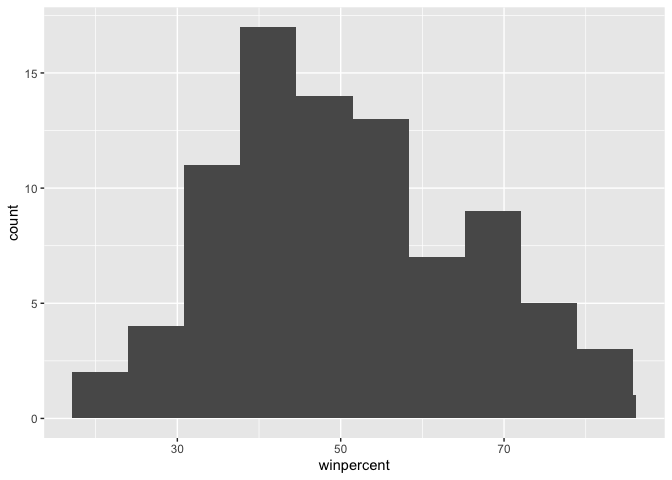
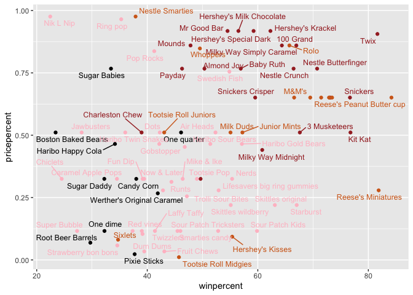
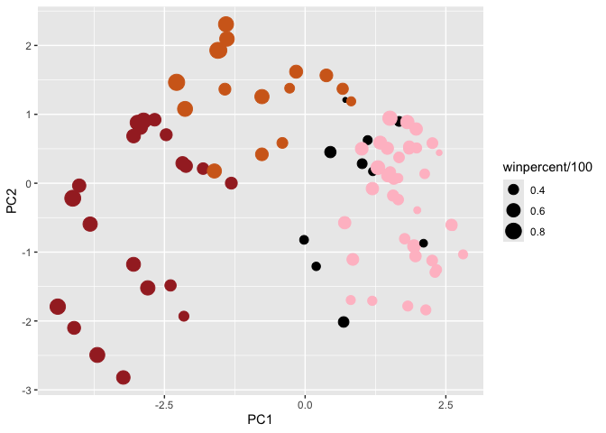
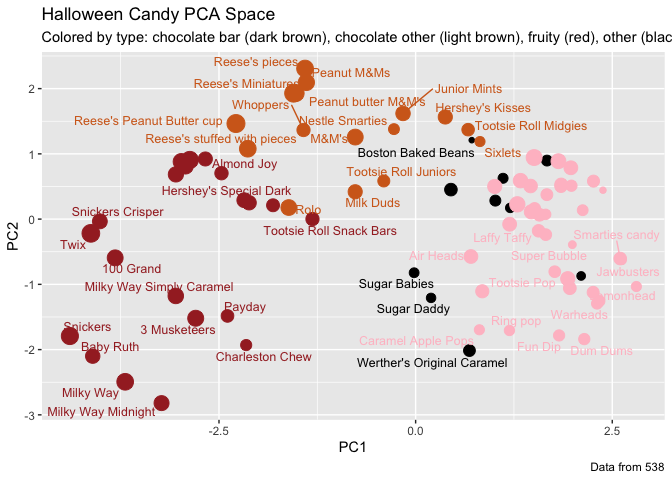
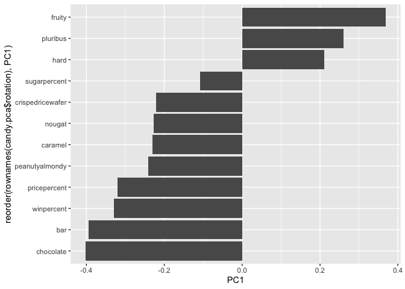

# BIMM 143 Class 09
Xaler Lu (A17384854)

## Background

Set up

``` r
candy <- read.csv("https://raw.githubusercontent.com/fivethirtyeight/data/master/candy-power-ranking/candy-data.csv", row.names = 1)
head(candy)
```

                 chocolate fruity caramel peanutyalmondy nougat crispedricewafer
    100 Grand            1      0       1              0      0                1
    3 Musketeers         1      0       0              0      1                0
    One dime             0      0       0              0      0                0
    One quarter          0      0       0              0      0                0
    Air Heads            0      1       0              0      0                0
    Almond Joy           1      0       0              1      0                0
                 hard bar pluribus sugarpercent pricepercent winpercent
    100 Grand       0   1        0        0.732        0.860   66.97173
    3 Musketeers    0   1        0        0.604        0.511   67.60294
    One dime        0   0        0        0.011        0.116   32.26109
    One quarter     0   0        0        0.011        0.511   46.11650
    Air Heads       0   0        0        0.906        0.511   52.34146
    Almond Joy      0   1        0        0.465        0.767   50.34755

## 2.1 What is in the dataset?

> Q1. How many different candy types are in this dataset?

There are 85 observations or candy types.

``` r
str(candy)
```

    'data.frame':   85 obs. of  12 variables:
     $ chocolate       : int  1 1 0 0 0 1 1 0 0 0 ...
     $ fruity          : int  0 0 0 0 1 0 0 0 0 1 ...
     $ caramel         : int  1 0 0 0 0 0 1 0 0 1 ...
     $ peanutyalmondy  : int  0 0 0 0 0 1 1 1 0 0 ...
     $ nougat          : int  0 1 0 0 0 0 1 0 0 0 ...
     $ crispedricewafer: int  1 0 0 0 0 0 0 0 0 0 ...
     $ hard            : int  0 0 0 0 0 0 0 0 0 0 ...
     $ bar             : int  1 1 0 0 0 1 1 0 0 0 ...
     $ pluribus        : int  0 0 0 0 0 0 0 1 1 0 ...
     $ sugarpercent    : num  0.732 0.604 0.011 0.011 0.906 ...
     $ pricepercent    : num  0.86 0.511 0.116 0.511 0.511 ...
     $ winpercent      : num  67 67.6 32.3 46.1 52.3 ...

> Q2. How many fruity candy types are in the dataset?

There are 38 fruity candies.

``` r
sum(candy$fruity)
```

    [1] 38

## 2.2 What is your favorite candy?

We can search a specific cell in the data to find the preference of
Twix.

``` r
candy["Twix", ]$winpercent
```

    [1] 81.64291

Alternatively, we use dplyr to find the preference of Twix.

``` r
library(dplyr)
```


    Attaching package: 'dplyr'

    The following objects are masked from 'package:stats':

        filter, lag

    The following objects are masked from 'package:base':

        intersect, setdiff, setequal, union

``` r
candy |> 
  filter(row.names(candy)=="Twix") |> 
  select(winpercent)
```

         winpercent
    Twix   81.64291

> Q3. What is your favorite candy (other than Twix) in the dataset and
> what is it’s winpercent value?

``` r
candy |> 
  filter(row.names(candy)=="Milky Way") |> 
  select(winpercent)
```

              winpercent
    Milky Way   73.09956

``` r
candy.win <- function(x) {
  candy |> 
  filter(row.names(candy)== x) |> 
  select(winpercent)
}

candy.win("Milky Way")
```

              winpercent
    Milky Way   73.09956

Milky Way has a win percent value of 73.10%.

> Q4. What is the winpercent value for “Kit Kat”?

The percent is 76.77% for Kit Kat

``` r
candy.win("Kit Kat")
```

            winpercent
    Kit Kat    76.7686

> Q5. What is the winpercent value for “Tootsie Roll Snack Bars”?

``` r
candy.win("Tootsie Roll Snack Bars")
```

                            winpercent
    Tootsie Roll Snack Bars    49.6535

Side-Note: The `skimr::skim()` function

``` r
library("skimr")
skim(candy)
```

|                                                  |       |
|:-------------------------------------------------|:------|
| Name                                             | candy |
| Number of rows                                   | 85    |
| Number of columns                                | 12    |
| \_\_\_\_\_\_\_\_\_\_\_\_\_\_\_\_\_\_\_\_\_\_\_   |       |
| Column type frequency:                           |       |
| numeric                                          | 12    |
| \_\_\_\_\_\_\_\_\_\_\_\_\_\_\_\_\_\_\_\_\_\_\_\_ |       |
| Group variables                                  | None  |

Data summary

**Variable type: numeric**

| skim_variable    | n_missing | complete_rate |  mean |    sd |    p0 |   p25 |   p50 |   p75 |  p100 | hist  |
|:-----------------|----------:|--------------:|------:|------:|------:|------:|------:|------:|------:|:------|
| chocolate        |         0 |             1 |  0.44 |  0.50 |  0.00 |  0.00 |  0.00 |  1.00 |  1.00 | ▇▁▁▁▆ |
| fruity           |         0 |             1 |  0.45 |  0.50 |  0.00 |  0.00 |  0.00 |  1.00 |  1.00 | ▇▁▁▁▆ |
| caramel          |         0 |             1 |  0.16 |  0.37 |  0.00 |  0.00 |  0.00 |  0.00 |  1.00 | ▇▁▁▁▂ |
| peanutyalmondy   |         0 |             1 |  0.16 |  0.37 |  0.00 |  0.00 |  0.00 |  0.00 |  1.00 | ▇▁▁▁▂ |
| nougat           |         0 |             1 |  0.08 |  0.28 |  0.00 |  0.00 |  0.00 |  0.00 |  1.00 | ▇▁▁▁▁ |
| crispedricewafer |         0 |             1 |  0.08 |  0.28 |  0.00 |  0.00 |  0.00 |  0.00 |  1.00 | ▇▁▁▁▁ |
| hard             |         0 |             1 |  0.18 |  0.38 |  0.00 |  0.00 |  0.00 |  0.00 |  1.00 | ▇▁▁▁▂ |
| bar              |         0 |             1 |  0.25 |  0.43 |  0.00 |  0.00 |  0.00 |  0.00 |  1.00 | ▇▁▁▁▂ |
| pluribus         |         0 |             1 |  0.52 |  0.50 |  0.00 |  0.00 |  1.00 |  1.00 |  1.00 | ▇▁▁▁▇ |
| sugarpercent     |         0 |             1 |  0.48 |  0.28 |  0.01 |  0.22 |  0.47 |  0.73 |  0.99 | ▇▇▇▇▆ |
| pricepercent     |         0 |             1 |  0.47 |  0.29 |  0.01 |  0.26 |  0.47 |  0.65 |  0.98 | ▇▇▇▇▆ |
| winpercent       |         0 |             1 | 50.32 | 14.71 | 22.45 | 39.14 | 47.83 | 59.86 | 84.18 | ▃▇▆▅▂ |

> Q6. Is there any variable/column that looks to be on a different scale
> to the majority of the other columns in the dataset?

The winpercent is on a different scale because it is a percentage while
the other are proportions. This means we need to set `scale = T` during
our PCA.

> Q7. What do you think a zero and one represent for the
> candy\$chocolate column?

The candy that is considered a chocolate candy.

## 3 Exploratory analysis

> Q8. Plot a histogram of winpercent values

``` r
hist(candy$winpercent)
```


``` r
library(ggplot2)
```

    Warning: package 'ggplot2' was built under R version 4.3.3

``` r
ggplot(candy, aes(winpercent)) + geom_histogram() + stat_bin(bins=10)
```

    `stat_bin()` using `bins = 30`. Pick better value with `binwidth`.



> Q9. Is the distribution of winpercent values symmetrical?

The histogram is ever-so-slightly skewed to the right, but I see one
peak.

> Q10. Is the center of the distribution above or below 50%?

The center distribution is below 50%.

> Q11. On average is chocolate candy higher or lower ranked than fruit
> candy?

Chocolate is ranked higher than fruit candy

``` r
mean(candy$winpercent[as.logical(candy$chocolate)])
```

    [1] 60.92153

``` r
mean(candy$winpercent[as.logical(candy$fruity)])
```

    [1] 44.11974

> Q12. Is this difference statistically significant?

Welch Two Sample T-Test: Comparing Chocolate with Fruity Candy

The p-value of 0.006 means we would reject the null hypothesis and
conclude that there is a statistical difference between chocolate and
fruity candy.

``` r
t.test(candy$winpercent[candy$fruity], candy$winpercent[as.logical(candy$chocolate)])
```


        Welch Two Sample t-test

    data:  candy$winpercent[candy$fruity] and candy$winpercent[as.logical(candy$chocolate)]
    t = 2.8727, df = 36, p-value = 0.006785
    alternative hypothesis: true difference in means is not equal to 0
    95 percent confidence interval:
      1.778754 10.321637
    sample estimates:
    mean of x mean of y 
     66.97173  60.92153 

## 4 Overall Candy Rankings

Use “Base R” `order()` to sort winpercent. This is the top five candy.
Either the Base R and dplyr are fine for this function.

> Q13. What are the five least liked candy types in this set?

In winpercent, the bottom five are below.

``` r
candy |> 
  arrange(winpercent) |> head(5)
```

                       chocolate fruity caramel peanutyalmondy nougat
    Nik L Nip                  0      1       0              0      0
    Boston Baked Beans         0      0       0              1      0
    Chiclets                   0      1       0              0      0
    Super Bubble               0      1       0              0      0
    Jawbusters                 0      1       0              0      0
                       crispedricewafer hard bar pluribus sugarpercent pricepercent
    Nik L Nip                         0    0   0        1        0.197        0.976
    Boston Baked Beans                0    0   0        1        0.313        0.511
    Chiclets                          0    0   0        1        0.046        0.325
    Super Bubble                      0    0   0        0        0.162        0.116
    Jawbusters                        0    1   0        1        0.093        0.511
                       winpercent
    Nik L Nip            22.44534
    Boston Baked Beans   23.41782
    Chiclets             24.52499
    Super Bubble         27.30386
    Jawbusters           28.12744

> Q14. What are the top 5 all time favorite candy types out of this set?

The top favorite candies.

``` r
candy |> 
  arrange(winpercent) |> tail(5)
```

                              chocolate fruity caramel peanutyalmondy nougat
    Snickers                          1      0       1              1      1
    Kit Kat                           1      0       0              0      0
    Twix                              1      0       1              0      0
    Reese's Miniatures                1      0       0              1      0
    Reese's Peanut Butter cup         1      0       0              1      0
                              crispedricewafer hard bar pluribus sugarpercent
    Snickers                                 0    0   1        0        0.546
    Kit Kat                                  1    0   1        0        0.313
    Twix                                     1    0   1        0        0.546
    Reese's Miniatures                       0    0   0        0        0.034
    Reese's Peanut Butter cup                0    0   0        0        0.720
                              pricepercent winpercent
    Snickers                         0.651   76.67378
    Kit Kat                          0.511   76.76860
    Twix                             0.906   81.64291
    Reese's Miniatures               0.279   81.86626
    Reese's Peanut Butter cup        0.651   84.18029

> Q15. Make a first barplot of candy ranking based on winpercent values.

``` r
ggplot(candy) +
  aes(winpercent, rownames(candy)) +
  geom_col()
```


> Q16. This is quite ugly, use the reorder() function to get the bars
> sorted by winpercent?

``` r
ggplot(candy) +
  aes(winpercent, reorder(rownames(candy), winpercent)) +
  geom_col()
```


## 4.0.1 Time to add some useful color

Color vectors for candy type.

``` r
my_cols=rep("black", nrow(candy))
my_cols[as.logical(candy$chocolate)] = "chocolate"
my_cols[as.logical(candy$bar)] = "brown"
my_cols[as.logical(candy$fruity)] = "pink"
```

Use `fill=my_cols` in `geom_col()`

``` r
ggplot(candy) +
  aes(winpercent, reorder(rownames(candy), winpercent)) +
  geom_col(fill = my_cols)
```


> Q17. What is the worst ranked chocolate candy?

The worst ranked chocolate candy is Sixlets.

> Q18. What is the best ranked fruity candy?

The best ranked fruity candy is Starburst.

## 5 Taking a look at pricepercent

Let’s analyze the cost vs win percentages.

``` r
library(ggrepel)
```

    Warning: package 'ggrepel' was built under R version 4.3.3

``` r
ggplot(candy) +
  aes(winpercent, pricepercent, label=rownames(candy)) +
  geom_point(col=my_cols) + 
  geom_text_repel(col=my_cols, size=3.3, max.overlaps = 10)
```

    Warning: ggrepel: 10 unlabeled data points (too many overlaps). Consider
    increasing max.overlaps



> Q19. Which candy type is the highest ranked in terms of winpercent for
> the least money - i.e. offers the most bang for your buck?

The cheapest and most favorite candy is the tootsie roll midgies.

``` r
ord <- order(candy$pricepercent, decreasing = FALSE)
head( candy[ord,c(11,12)], n=5 )
```

                         pricepercent winpercent
    Tootsie Roll Midgies        0.011   45.73675
    Pixie Sticks                0.023   37.72234
    Dum Dums                    0.034   39.46056
    Fruit Chews                 0.034   43.08892
    Strawberry bon bons         0.058   34.57899

> Q20. What are the top 5 most expensive candy types in the dataset and
> of these which is the least popular?

The most expensive is both the Nik L Nip and the Nestle Smarties. The
least popular is the Nik L Nip with a win percent of 22.44%.

``` r
tail( candy[ord,c(11,12)], n=5 )
```

                           pricepercent winpercent
    Hershey's Special Dark        0.918   59.23612
    Mr Good Bar                   0.918   54.52645
    Ring pop                      0.965   35.29076
    Nik L Nip                     0.976   22.44534
    Nestle Smarties               0.976   37.88719

## 6 Exploring the Correlation Structure

Lets look at the correlation with the `corrplot` package

``` r
library(corrplot)
```

    Warning: package 'corrplot' was built under R version 4.3.3

    corrplot 0.95 loaded

``` r
cij <-cor(candy)
corrplot(cij)
```


> Q22. Examining this plot what two variables are anti-correlated
> (i.e. have minus values)?

Chocolate and fruity, bar and fruity, pluribus and bar are
anti-correlated.

> Q23. Similarly, what two variables are most positively correlated?

Chocolate and bar are positively correlated. Chocolate and win percent,
too, meaning people tend to enjoy chocolate candy more. I don’t know if
I ever seen a chocolaty fruity candy before.

## 7 Principal Component Analysis

``` r
candy.pca <- prcomp(candy, scale = T)
summary(candy.pca)
```

    Importance of components:
                              PC1    PC2    PC3     PC4    PC5     PC6     PC7
    Standard deviation     2.0788 1.1378 1.1092 1.07533 0.9518 0.81923 0.81530
    Proportion of Variance 0.3601 0.1079 0.1025 0.09636 0.0755 0.05593 0.05539
    Cumulative Proportion  0.3601 0.4680 0.5705 0.66688 0.7424 0.79830 0.85369
                               PC8     PC9    PC10    PC11    PC12
    Standard deviation     0.74530 0.67824 0.62349 0.43974 0.39760
    Proportion of Variance 0.04629 0.03833 0.03239 0.01611 0.01317
    Cumulative Proportion  0.89998 0.93832 0.97071 0.98683 1.00000

Plot with “Base R”

``` r
plot(candy.pca$x[,1:2], col=my_cols, pch = 16)
```


Plot using ggplot

``` r
candy.data <- cbind(candy, candy.pca$x[,1:3])
```

``` r
candy.pca.plot <- ggplot(candy.data) + 
  aes(PC1, PC2, 
      size = winpercent/100,
      text = rownames(candy.data),
      label = rownames(candy.data)) + 
  geom_point(col = my_cols)
candy.pca.plot
```



Use `ggrepel` to label the plot

``` r
candy.pca.plot + geom_text_repel(size=3.3, col=my_cols, max.overlaps = 7)  + 
  theme(legend.position = "none") +
  labs(title="Halloween Candy PCA Space",
       subtitle="Colored by type: chocolate bar (dark brown), chocolate other (light brown), fruity (red), other (black)",
       caption="Data from 538")
```

    Warning: ggrepel: 39 unlabeled data points (too many overlaps). Consider
    increasing max.overlaps



Use `plotly` package to generate an interactive plot, but we will not
include this for the PDF format.

``` r
# library(plotly)
# ggplotly(candy.pca.plot)
```

Let’s plot the effects of PC1

``` r
ggplot(candy.pca$rotation) + 
  aes(PC1, reorder(rownames(candy.pca$rotation), PC1)) +
  geom_col()
```



> Q24. Complete the code to generate the loadings plot above. What
> original variables are picked up strongly by PC1 in the positive
> direction? Do these make sense to you? Where did you see this
> relationship highlighted previously?

Fruity, pluribus, and hard candies tend to be strongly and positively
supported by PC1. This makes sense because the fruity candies are
negatively correlated to chocolate candy, which are on the negative side
of PC1. These tend to be different from chocolate, according to both the
PCA chart and correlation plot.

## Summary

> Q25. Based on your exploratory analysis, correlation findings, and PCA
> results, what combination of characteristics appears to make a
> “winning” candy? How do these different analyses (visualization,
> correlation, PCA) support or complement each other in reaching this
> conclusion?

The most popular type of candy is chocolate. Chocolate candies are more
expensive, but more popular. According to the correlation plot,
chocolate candies are positively correlated to popularity (win percent)
and price. Overall, fruity candies are cheaper, less popular, and
negatively correlated with chocolate. The cheapest, popular candy is the
fruity Tootsie roll.
