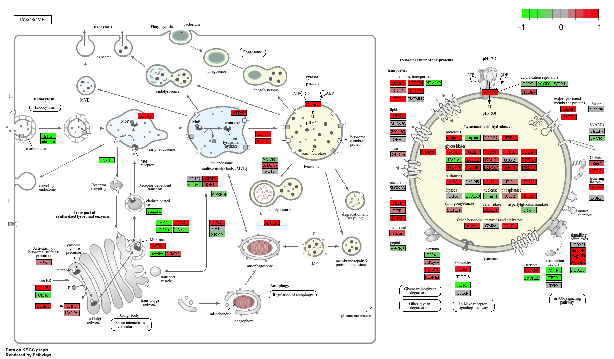

## Background

Previously, we have used DESeq to interpret RNA-seq data. We also annotated our data and used pathway analysis to map genes to known biological pathways. Here, we will work on a mini-project that will use the same methods. 

## (1) Differential Expression Analysis

```{r, message = FALSE, warning=FALSE}
library(DESeq2)
```

Download both the count data and meta data (also called column data).
```{r}
metaFile <- "GSE37704_metadata.csv"
countFile <- "GSE37704_featurecounts.csv"

metaData = read.csv(metaFile, row.names = 1)
head(metaData)
```

```{r}
countsA = read.csv(countFile, row.names = 1)
head(countsA)
```

> Q. Complete the code below to remove the troublesome first column from counts

Now, we need to match the count data and meta data with a 1:1 correspondence, but the first column of the count data is just the length and needs to be removed. 

```{r}
counts <- as.matrix(countsA[,-1])
```

> Q. Complete the code below to filter counts to exclude genes (i.e. rows) where we have 0 read count across all samples (i.e. columns).

```{r}
counts <- counts[rowSums(counts) != 0,]
head(counts)
```
### DESeq

We will run DESeq2 with `DESeqDataSetFromMatrix()` with three required arguments: `counts`, `metaData`, and `design`. `design` is the name of the column in `metaData` 

```{r}
dds <- DESeqDataSetFromMatrix(countData = counts,
                              colData = metaData,
                              design = ~condition)
```

With `dds`, we will run it with `DESeq()`


```{r}
dds <- DESeq(dds)
dds
```
> Q. Call the summary() function on your results to get a sense of how many genes are up or down-regulated at the default 0.1 p-value cutoff.

Here are the results. 4349 upregulated genes below 0.1 p-value, and 4396 downregulated genes below 0.1 p-value.
```{r}
res <- results(dds)
summary(res)
```

### Volcano Plot

```{r, message= FALSE}
library(ggplot2)
```

```{r}
head(res$log2FoldChange)
```


```{r}
ggplot(res) +
  aes(log2FoldChange, -log(padj)) +
  geom_point()
```
> Q. Improve this plot by completing the below code, which adds color, axis labels and cutoff lines:

```{r}
# Make a color vector for all genes
mycols <- rep("gray", nrow(res) )

# Color blue the genes with fold change above 2
mycols[ abs(res$log2FoldChange) > 2 ] <- "blue4"

# Color gray those with adjusted p-value more than 0.01
mycols[ res$padj > 0.05 ] <- "gray"

ggplot(res) +
  aes(log2FoldChange, -log(padj)) +
  geom_point(col = mycols) +
  xlab("Log2(FoldChange)") +
  ylab("-Log(P-value)") +
  geom_vline(xintercept = c(-2,2), col = "red", lty = 2) +
  geom_hline(yintercept = -log(0.05), col = "red", lty = 2)
```

### Gene Annotation

We want to use pathway analysis using the KEGG pathway. Let's first annotate with ENTREZID.

> Q. Use the mapIDs() function multiple times to add SYMBOL, ENTREZID and GENENAME annotation to our results by completing the code below.

```{r, message = FALSE}
library("AnnotationDbi")
library("org.Hs.eg.db")
```


```{r}
columns(org.Hs.eg.db)
```
Essentially, we want to use `mapIds()` to create new columns with symbol using `SYMBOL`, entrez using `ENTREZID`, and gene name using `GENENAME`. The keytype is `ENSEMBLE`
```{r}
res$symbol <- mapIds(org.Hs.eg.db,
                     keys = row.names(res),
                     keytype = "ENSEMBL",
                     column = "SYMBOL",
                     multiVals = "first")

res$entrez <- mapIds(org.Hs.eg.db,
                     keys = row.names(res),
                     keytype = "ENSEMBL",
                     column = "ENTREZID",
                     multiVals = "first")

res$name <- mapIds(org.Hs.eg.db,
                   keys = row.names(res),
                   keytype = "ENSEMBL",
                   column = "GENENAME",
                   multiVals = "first")
```
```{r}
head(res, 10)
```

> Q. Finally for this section let's reorder these results by adjusted p-value and save them to a CSV file in your current project directory.


```{r}
res <- res[order(res$pvalue),]
write.csv(res, file = "deseq_results.csv")
```


## (2) Pathway Analysis

We will use `gage` and the **KEGG** database, specifically `kegg.sets.hs`. We can also use others like `go.sets.hs` or `sigmet.idx.hs`.

```{r, message = FALSE}
library(pathview)
library(gage)
library(gageData)
```

```{r}
data(kegg.sets.hs)
data(sigmet.idx.hs)

#Focus on signaling and metabolic pathways only
kegg.sets.hs <- kegg.sets.hs[sigmet.idx.hs]

# Examine the first 3 pathways
head(kegg.sets.hs, 3)
```

With the data, we will use `gage()` which would require a vector of ENTREZID values because we are using **KEGG*
```{r}
foldchanges <- res$log2FoldChange
names(foldchanges) <- res$entrez
head(foldchanges)
```

```{r}
keggres = gage(foldchanges, gsets=kegg.sets.hs)
```

```{r}
attributes(keggres)
```

Here are the top six downregulated pathways
```{r}
head(keggres$less)
```

Here is the pathway of the Cell Cycle pathway
```{r}
pathview(gene.data=foldchanges, pathway.id="hsa04110", kegg.native=FALSE)
```


Below is a demo of creating multiple pathviews of the top five upregulated pathways at once.

```{r}
keggrespathways <- rownames(keggres$greater)[1:5]

# Extract the 8 character long IDs part of each string
keggresids = substr(keggrespathways, start=1, stop=8)
keggresids
```

```{r}
pathview(gene.data=foldchanges, pathway.id=keggresids, species="hsa")
```




Q. Can you do the same procedure as above to plot the pathview figures for the top 5 down-regulated pathways?

```{r}
keggrespathways.down <- row.names(keggres$less)[1:5]

keggresids.down <- substr(keggrespathways.down, start = 1, stop = 8)
keggresids.down
```

```{r}
pathview(gene.data=foldchanges, pathway.id=keggresids.down, species="hsa")
```


## (3) Gene Ontology

We will do a similar procedure with Gene Ontology using `go.sets.hs` that us all GO terms. `go.subs.hs` is a named list containing BP, CC, and MF ontologies.

```{r}
data(go.sets.hs)
data(go.subs.hs)
```

```{r}
gobpsets = go.sets.hs[go.subs.hs$BP]

gobpres = gage(foldchanges, gsets=gobpsets)

lapply(gobpres, head)
```

## (4) Reactome Analysis


Reactome is a database consisting of biological molecules and their relation to pathways and processes. Let's conduct over-representation enrichment analysis and pathway-topology analysis. <https://bioconductor.org/packages/release/bioc/html/ReactomePA.html> and <https://reactome.org/> Don't forget to install `BiocManager::install("ReactomePA")` if you want to do this in R, but otherwise, do this on the web page.

```{r}
sig_genes <- res[res$padj <= 0.05 & !is.na(res$padj), "symbol"]
print(paste("Total number of significant genes:", length(sig_genes)))
```

```{r}
write.table(sig_genes, file="significant_genes.txt", row.names=FALSE, col.names=FALSE, quote=FALSE)
```

> Q. What pathway has the most significant “Entities p-value”? Do the most significant pathways listed match your previous KEGG results? What factors could cause differences between the two methods?

The pathway with the most significance is the mitotic cell cycle pathway with a P-value of 2.02E-5. The cell cycle in KEGG is also the most significant. The difference between KEGG and Reactome is that KEGG shows the cell cycle at one layer, but Reactome shows the cell cycle at various levels. 


